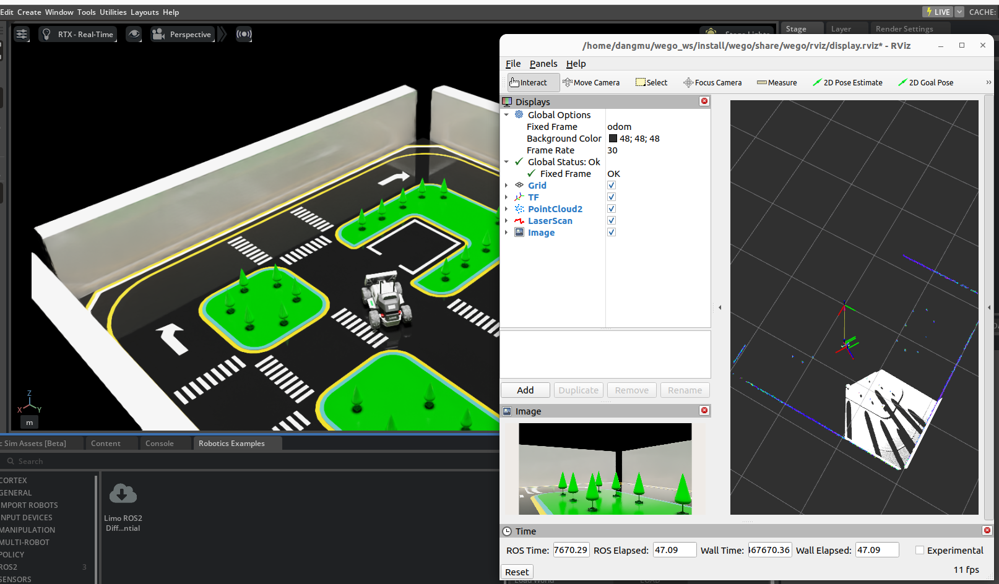
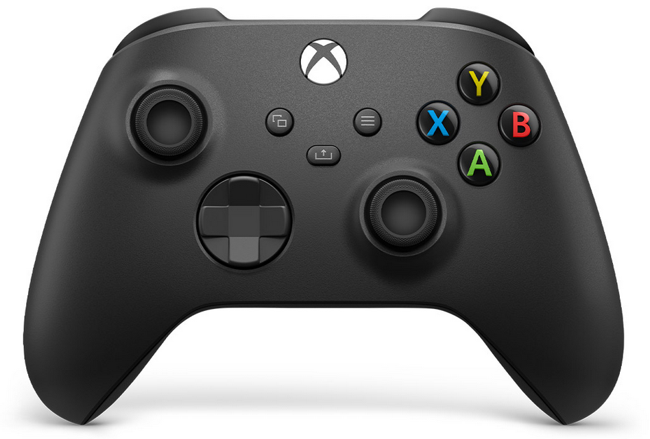
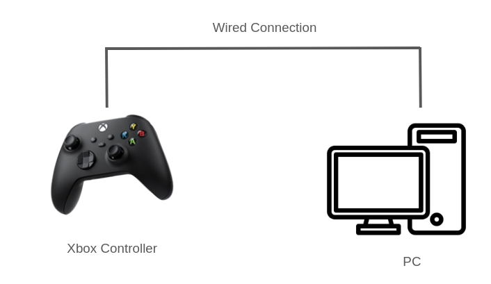
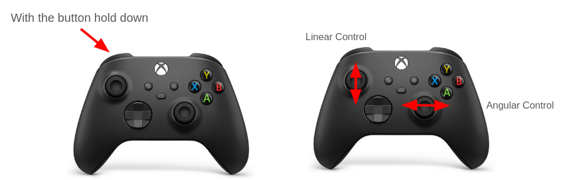
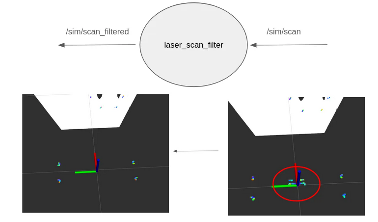

# URL
- The wiki page you can refer here

https://goofy-pleasure-a84.notion.site/Limo-ISAACSIM-Example-Package-1ff09b2ac4bf806886e1e13976cf80f0?source=copy_link

## Compatible Version
- Ubuntu 22.04
- ROS2 Humble

## Basic Setup
- Setup for workspace and install dependency package.

```
$ cd ~/
$ mkdir -p wego_ws/src
$ cd ~/wego_ws/src
$ git clone -b ros2 https://github.com/WeGo-Robotics/LimoIsaacSIM.git
$ cd ..
$ rosdep install --from-paths src --ignore-src -r -y
$ colcon build
```
## View Sensor data 
You can see the sensor data with RViz
```
# With Limo Isaac sim played
$ cd ~/wego_ws
$ source install/setup.bash
$ ros2 launch wego display_launch.py
```



## JoyStick Application

You can control Limo with Joystick

The joystick which you can use is Xbox Joystick



Also you can connect your joystick with cable 



After Connecting the Joystick you can launch the application

```
# With Limo Isaac sim played
$ cd ~/wego_ws
$ source install/setup.bash
$ ros2 launch wego joystick_launch.py
```

You can control limo with joystick shown the picture below


The Joystick Application is designed with a structure that allows for easy transitions between autonomous and manual control modes.


## Scan filter

You can filter the lidar data which detect Limo's body itself,

 ```
# With Limo Isaac sim played
$ cd ~/wego_ws
$ source install/setup.bash
$ ros2 launch wego scan_filter_launch.py
```

This application will filter out the lidar scan data like this.
